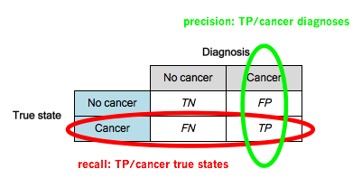
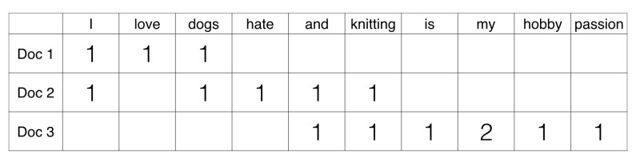

# Machine Learning Engineer Nanodegree Capstone Report

## Topic: Using Twitter Data for NLP and Sentiment Analysis

#### Siddhesh Khedekar

#### December 10, 2018

---

## I. Definition

In today's time, microblogging has become the most widely used communication tool among users of the web, especially through social media sites. Daily millions of messages and posts appear on popular social media networks and websites such as Facebook, Twitter, Reddit, Quorra that provide microblogging services. People on such sites write about their life, discuss current issues and share their opinions on a variety of topics. More and more Internet users are shifting towards microblogging platforms from blogs or mailing lists which are the most common traditional communication tools as they give more easy accessibility and free format of communication. Every day an increasing number of users post their reviews about the products they use along with their religious and political views. Social media and microblogging websites have become valuable sources for analysis of opinions and sentiments such data can be efficiently used for digital marketing and social studies.

### Project Overview

The problem I will be working upon is detecting the sentiment of a text string being positive or negative. Through proper implementation of Natural Language Processing it is possible to learn a lot from simple data streams such as Twitter posts. A number of domains can benefit from Sentiment Analysis and its applications in today's world are ever increasing. Some of the domains Sentiment Analysis finds its uses are listed below.

##### E-Commerce Sites

E-commerce activities involve the most general use of sentiment analysis. Sites allow their users to submit their reviews about product qualities and shopping experiences. For every product, a summary is provided along with its different features and user-assigned rating and scores. New users can view recommendations and opinions regarding a product and its individual features. Visualization using graphical models of overall features and products help users choose. Amazon, Flipkart and other popular merchant websites provide reviews and ratings from users. Trivago and Tripadvisor are popular websites that provide reviews on travel destinations and hotels. they contain millions of opinions from across the world. Sentiment Analysis helps in converting the huge volume of opinions of users into promoting business.

##### Government Organizations

Governments can assess their strengths and weaknesses through Sentiment analysis of the opinions of the citizens. A Twitter poll of who is most likely to win an election is the most basic example of sentiment analysis at work.  Be it tracking of peoples opinions on a newly proposed law or some newly introduced system or identifying improvements in campaigns and many other similar areas, we can see the potential for sentiment analysis.

##### BRM, VOM, VOC

The concern about managing a companies reputation in the market is described as Brand Reputation Management(BRM). BRM is focused more on the company rather than the customer. Analysis of Sentiment proves to be helpful in determining how a company’s brand, service or product is being perceived by community online.

Determining what customers are feeling about services or products of competitors is termed as Voice of the Market(VOM). With sentiment analysis, it is possible to get customer opinion in real-time. This accumulated data can help companies can predict the chances of product failure to design new marketing strategies and improve product features.

The concern about what individual customers are saying about services and products is defined as Voice of the Customer(VOC). VOC is the analyzing of feedback and reviews of the users. Obtaining customer opinions helps non-functional requirements like cost and performance and some identify the functional requirements of the products.

### Problem Statement

The project goal is to build a sentiment analysis model with given training dataset. In this notebook, I make the steps towards developing an algorithm that could be used as part of a mobile or web application that analyzes the sentiment of a provided text.  Later it can also be applied to tweets gathered through twitter API. Once the model is built, done training on the data and analyzing the validation set, at the end of this project, my code will accept the test set and predict its accuracy. The image below displays a sample output of my finished project. 

In this real-world setting, I pieced together a series of models to perform different tasks; for instance, the algorithm that detects sentiment. No perfect algorithm exists, and there are many points of possible failure. My imperfect solution nonetheless did create a very fun experience for me! I broke the task into separate steps to help in understanding the project as noted below.

* Step 0: Import Datasets and Data Preparation
* Step 1: Data Cleaning and Saving Cleaned Data as CSV
* Step 2: Explanatory Data Analysis and Visualisation of Zipf’s Law
* Step 3: Data Split and Benchmark Selection
* Step 4: Feature Investigation and Extraction
* Step 5: Model Comparison and Creating a CNN
* Step 6: Training Model and Measuring Validation Accuracy
* Step 7: Testing Model and Getting the Final Result

#### Dataset

For the twitter sentiment analysis model, I have chosen a dataset of tweets labeled either positive or negative. The dataset for training the model is from "Sentiment140", a dataset originated from Stanford University. More info on the dataset can be found on its official [website](http://help.sentiment140.com/for-students/).

The dataset can be downloaded from the provided [link](http://cs.stanford.edu/people/alecmgo/trainingandtestdata.zip). First look at the description of the dataset, the following information on each field can be found.

1. sentiment of the tweet (0 = negative, 4 = positive)
2. id of the tweet (3223)
3. date of the tweet (Sun Mar 12 13:38:45 UTC 2006)
4. query_string (qwe). NO_QUERY is set as value if there is no query
5. user that tweeted (dcrules)
6. text of the tweet (Marvel is cool)

### Metrics

Before I train any model, I need to split the data. And considering the Here I chose to split the data into three sets: train, validation, and test. The ratio I decided to split my data is 98/1/1, 98% of the data as the training set, and 1% for the dev set, and the final 1% for the test set. The dataset has more than 1.5 million entries. This is more than enough to evaluate the model and refine the parameters.

- Train set: The portion of data to use for learning
- Validation set (Hold-out cross-validation set): The portion of data to use for fine-tuning the parameters of a classifier, and provide an unbiased evaluation of a model.
- Test set: The portion of data to use only to assess the performance of a final model.

The functional representations for how the solution can be measured will be the two evaluation metrics stated below. The main evaluation metric for the model will be the validation set accuracy, the testing set accuracy along with their respective comparisons to the benchmarks accuracy.

##### Explaining the Confusion Matrix and Classification Report

Here I briefly explain about confusion matrix and classification report. In order to evaluate the performance of a model, there are many different metrics that can be used. Here I will talk in case of binary classification, in which the target variable only has two classes to be predicted. In the case of this project, the classes are either "negative" or "positive". One obvious measure of performance can be accuracy. It is the number of times the model predicted correctly for the class over the number of the whole data set. But in case of classification, this can be broken down further.
Below is a representation of confusion matrix.

In the above matrix, each row represents the instances in an actual class while each column represents the instances in a predicted class, and it can be also presented swapping rows and columns (column for the actual class, row for predicted class). So the accuracy (ACC) I mentioned above can be expressed as below.

$${ACC} = \frac {True Positive + True Negative}{Positive + Negative} = \frac {True Positive + True Negative}{True Positive + False Positive + True Negative + False Negative}$$

When the distribution of the classes in data is well balanced, accuracy can give you a good picture of how the model is performing. But when you have skewed data, for example, one of the class is dominant in your data set, then accuracy might not be enough to evaluate your model. Let's say you have a dataset which contains 80% positive class, and 20% negative class. This means that by predicting every data into the positive class, the model will get 80% accuracy. In this case, you might want to explore further into the confusion matrix and try different evaluation metrics. There can be 9 different metrics, just from the combination of numbers from confusion matrix, but I will talk about two of them in particular, and another metric which combines these two.

"Precision" (also called Positive Predictive Value) tells you what proportion of data predicted as positive actually is positive. In other words, the proportion of True Positive in the set of all positive predicted data.

$${PPV(Precision)} = \frac {True Positive}{True Positive + False Positive}$$

"Recall" (also called Sensitivity, Hit Rate, True Positive Rate) tells you what proportion of data that actually is positive were predicted positive. In other words, the proportion of True Positive in the set of all actual positive data.

$${TPR(Recall)} = \frac {True Positive}{Positive} = \frac {True Positive}{True Positive + False Negative}$$

Below is the image of confusion matrix of cancer diagnose. If you think of "cancer" as positive class, "no cancer" as a negative class, the image explains well how to think of precision and recall in terms of the confusion matrix.

And finally, the F1 score is the harmonic mean of precision and recall. The harmonic mean is a specific type of average, which is used when dealing with averages of units, like rates and ratios. So by calculating the harmonic mean of the two metrics, it will give you a good idea of how the model is performing both in terms of precision and recall. The formula is as below

$${F1} = 2\cdot\frac {Precision\cdot Recall}{Precision + Recall}$$

---

## II. Analysis

In order to train my twitter sentiment classifier, I needed a dataset which meets conditions below.

- big enough to train a model
- preferably tweets text data with annotated sentiment label
- with at least 2 sentiment classes: negative and positive

While googling to find a good data source, I learned about renowned NLP competition called [Sentiment140 dataset with 1.6 million tweets](https://www.kaggle.com/kazanova/sentiment140) on Kaggle. 

### Data Exploration

#### Data Preparation

There are 1.6 million entries in the Dataset, with no null entries, especially for the "sentiment" column. 50% of the data is with a negative label and another 50% with a positive label. There's no skewness on the class division. By generally looking at some entries for each class, I concluded all the negative class is from the 0~799999th index, and the positive class entries start from 800000 to the end of the dataset.

I first started by dropping the columns that I don't need for the specific purpose of sentiment analysis namely for the four below.

- "id" column is the unique ID for each tweet
- "date" column is for date and time info for the tweet
- "query_string" column indicates whether the tweet has been collected with any particular query keyword, but for this column, 100% of the entries are with value "NO_QUERY"
- "user" column is the twitter username for the one who tweeted

### Exploratory Visualization

#### Explanatory Data Analysis using Word Cloud

A word cloud represents word usage in a document by resizing individual words proportionally to its frequency and then presenting them in a random arrangement. It is a very crude form of textual analysis, and it is often applied to situations where textual analysis is not appropriate, it does not provide a narrative and it gives no context summary of the data. But in the case of tweets, a textual analysis will do, and it provides a general idea of what kind of words are frequent in the corpus. For visualization, I used the python library word cloud

The wordcloud visualization of the tweets having positive sentiment.

The wordcloud visualization of the tweets having negative sentiment.

#### Results from Word Cloud

Some of the big words can be interpreted quite neutral. I can see some of the words in a smaller size make sense to be in positive tweets or in the negative tweets. Interestingly, many words like "love" and "work" were quite big in the negative word cloud, but also quite big in the positive word cloud. It might imply that many people express negative sentiment towards them, but also many people are positive about them.

#### Preparation for Data Visualisation using Count Vectorizer

In order to implement data visualization of Zipf’s Law, I need term frequency data. I selected count vectorizer to calculate the term frequencies. I implemented count vectorizer with stop words included, and not limiting the maximum number of terms. With count vectorizer, I merely count the appearance of the words in each text. For example, let's say I have 3 documents in a corpus: "I love dogs", "I hate dogs and knitting", "Knitting is my hobby and my passion". If I build vocabulary from these three sentences and represent each document as count vectors, it will look like below picture.

The tabular visualization of the frequencies of the top 10 words appearing in the tweets having positive, negative and total column.

#### Zipf's Law Definition

It states that the vast majority are used very rarely, while a small number of words are used all the time. The frequency of any word is inversely proportional to its rank in the frequency table, given some corpus of natural language utterances. Thus the nth most frequent word will occur approximately 1/n times as often as the most frequent word.

The actual formula goes something like this
$${f(r)} \propto \frac{1}{r^\alpha}$$
for
$$\alpha \approx {1}$$

Below I plot the tweet tokens and their frequencies.

#### Results of Plain Plot

Y-axis is the "Sentiment140" dataset frequency. The x-axis is the rank of the frequency 500 ranks from left to the right. In most cases the actual observations do not strictly follow Zipf's distribution, but rather a near-Zipfian distribution. It looks like there is more area above the expected Zipf curve in higher ranked words. The log-log, with X-axis being log(rank), Y-axis being log(frequency) scale will yield a roughly linear line on the graph.

#### Results of Log Plot

It is clearly seen again that the graph is a roughly linear curve, but at the lower ranks, we see the actual observation line lies below the expected linear line and deviating above the expected line on higher ranked words.

### Algorithms and Techniques

#### Feature Investigation using CountVec

If the size of the corpus gets big, the number of vocabulary gets too big to process. With my 1.5 million tweets, if I build vocabulary without limiting the number of vocabulary, I will have more than 260,000 vocabularies. This means that the shape of training data will be around 1,500,000 x 260,000, this sounds too big to train various different models with. So I decided to limit the number of vocabularies, but I also wanted to see how the performance varies depending on the number of vocabularies.

Another thing I wanted to explore is stopwords. Stop Words are words which do not contain important significance, such as "the", "of", etc. It is often assumed that removing stopwords is a necessary step, and will improve the model performance. But I wanted to see for myself if this is really the case. So I ran the same test with and without stop words and compared the result. In addition, I also defined my custom stopwords list, which contains top 10 most frequent words in the corpus: "to", "the", "my", "it", "and", "you", "not", "is", "in", "for".

A model I chose to evaluate different count vectors is the logistic regression. It is one of the linear models, so computationally scalable to big data, compared to models like KNN or random forest. And once I have the optimal number of features and make a decision on whether to remove stop words or not, then I will try different models with the chosen number of vocabularies' count vectors.

#### Feature Investigation using Unigram/Bigram/Trigram

According to Wikipedia, "n-gram is a contiguous sequence of n items from a given sequence of text or speech". In other words, n-grams are simply all combinations of adjacent words or letters of length n that you can find in your source text. Below picture represents well how n-grams are constructed out of source text. In this project, I will extend the bag-of-words to trigrams, and see if it affects the performance.

#### Feature Investigation using Word2Vec

Before I jump into doc2vec, it will be better to first start by word2vec. "Word2vec is a group of related models that are used to produce word embeddings. These models are shallow, two-layer neural networks that are trained to reconstruct linguistic contexts of words."

Word2vec is not a single algorithm but consists of two techniques – CBOW(Continuous bag of words) and Skip-gram model. Both of these techniques learn weights which act as word vector representations. With a corpus, CBOW model predicts the current word from a window of surrounding context words, while Skip-gram model predicts surrounding context words given the current word. In Gensim package, you can specify whether to use CBOW or Skip-gram by passing the argument "sg" when implementing Word2Vec. By default (sg=0), CBOW is used. Otherwise (sg=1), skip-gram is employed.

For example, let's say we have the following sentence: "I love dogs". CBOW model tries to predict the word "love" when given "I", "dogs" as inputs, on the other hand, Skip-gram model tries to predict "I", "dogs" when given the word "love" as input. But what's used as word vectors are actually not the predicted results from these models but the weights of the trained models. By extracting the weights, such a vector comes to represent in some abstract way the ‘meaning’ of a word. Below picture represents more formally how these two models work.

#### Feature Investigation using Doc2Vec

Then what is doc2vec? Doc2vec uses the same logic as word2vec, but apply this to the document level. According to Mikolov et al. (2014), "every paragraph is mapped to a unique vector, represented by a column in matrix D and every word is also mapped to a unique vector, represented by a column in matrix W. The paragraph vector and word vectors are averaged or concatenated to predict the next word in a context...The paragraph token can be thought of as another word. It acts as a memory that remembers what is missing from the current context – or the topic of the paragraph." https://cs.stanford.edu/~quocle/paragraph_vector.pdf

##### DM:

This is the Doc2Vec model analogous to CBOW model in Word2vec. The paragraph vectors are obtained by training a neural network on the task of inferring a centre word based on context words and a context paragraph. 

##### DBOW:

This is the Doc2Vec model analogous to Skip-gram model in Word2Vec. The paragraph vectors are obtained by training a neural network on the task of predicting a probability distribution of words in a paragraph given a randomly-sampled word from the paragraph.

I implemented Doc2Vec model using a Python library, Gensim. In case of DM model, I implemented averaging and concatenating. This is inspired by the research paper from Le and Mikolov (2014). In their paper, they have implemented DM model in two different way, using average calculation process for the paragraph matrix, and concatenating calculation method for the paragraph matrix. This has also been shown in Gensim's tutorial.

### Benchmark

#### Zero Rule

All the model performance will be compared to fit the same training and validation set. Baseline or benchmark provides a point of reference to compare when comparing various machine learning algorithms. Zero Rule (ZeroR) is one of the most popular baselines. It simply predicts the majority category (class). There is no predictability power in ZeroR but it is useful for determining a baseline performance as a benchmark for other classification methods. 

#### Results of Zero Rule

As I can see from the above validation set class division, the majority class is positive with 50.35%, which means if a classifier predicts positive for every validation data, it will get 50.35% accuracy.

#### TextBlob

Another benchmark I wanted to compare the validation results with is TextBlob. This python library helps in processing textual data. Apart from other useful tools such as POS tagging, n-gram, The package has built-in sentiment classification. It is an out-of-the-box sentiment analysis tool. I will keep in mind of the accuracy I get from TextBlob sentiment analysis along with the null accuracy to see how my model is performing.

#### Results of TextBlob

TextBlob sentiment analysis yielded 62.75% accuracy on the validation set, which is 12.74% more accurate than null accuracy (50.35%).

---

## III. Methodology

### Data Preprocessing

#### Data Cleaning

Before I move on to Explanatory data analysis and visualization. I had to get the data cleaning part done right. As a way of sanity check, I took a look at the length of the string in the text column in each entry. I did a plot pre_clean_len with box plot so that I can see the overall distribution of length of strings in each entry. This looked a bit strange since twitter's character limit is 140. But from the boxplot, some of the tweets are way more than 140 characters long.

##### HTML decoding

Looking at the data I realized that the HTML encoding had not been converted to text and ended up in the text field as '&amp', '&quot', etc. Decoding HTML to general text was my first step in data cleaning. I used BeautifulSoup for this.

##### @Mention

I also had to deal with @mention. Although @mention carries a certain information (which another user that the tweet mentioned), this information does not add value to build sentiment analysis model. With a little googling, I found out that twitter ID also allows the underscore symbol as a character can be used with ID. Except for the underscore symbol, only characters allowed are alphabets and numbers.

##### URL links

I had to get rid of the URL links, same as with @mention, although they carry some information, for sentiment analysis purpose, this can be ignored. I recognized is that some of the URL links don't start with "HTTP", sometimes people paste a link in "www.aaaa.com" form. I need a regex pattern to catch the part of the URL that contains alphabets, numbers, periods, slashes and also if it contains any other special character such as "=", "_", "~", etc.</n>

##### UTF-8 Byte Order Mark(BOM)

By looking at some of the entries in the data I could see some strange patterns of characters "\xef\xbf\xbd". After some intensive research, I understood these to be UTF-8 BOM. "The UTF-8 BOM is a sequence of bytes (EF BB BF) that enables the reader to recognize a file as being encoded in UTF-8." By decoding text with 'UTF-8-sig', this BOM will be substituted with Unicode unrecognizable special characters, then I can process this as "?"

##### Hashtag / Numbers

A hashtag can contribute valuable information about the tweet. It might be a bit dangerous to get rid of all the text together with the hashtag. So I chose to leave the text intact and just remove the '#'. I will do this in the process of refining all the non-letter characters including numbers.

##### Defining data cleaning function

With above five data sanitation task, I will first define data cleaning function, and then will be implemented to the whole dataset. Tokenization, stemming/lemmatization, stop words will be dealt with the later stage when creating a matrix with either count vectorizer or Tfidf vectorizer.

A major issue I realized is that, during the cleaning process, negation words are split into two parts, and the 't' after the apostrophe vanishes when I filter tokens with length more than one syllable. Because of this words like "can't" end up as same as "can". This end case needs to be handled for the purpose of sentiment analysis.

### Implementation

##### Model Comparison using Features

1. DBOW (Distributed Bag of Words)
2. DMC (Distributed Memory Concatenated)
3. DMM (Distributed Memory Mean)
4. DBOW + DMC
5. DBOW + DMM
6. CBOW + 

With above vectors, I fitted the model and evaluate the result on the validation set. I compared different combinations and input only the best combination to my model.

##### Preparation for Convolutional Neural Network

In order to feed to a CNN, I have to not only feed each word vector to the model, but also in a sequence which matches the original tweet.

For example, let's say I have a sentence as below.

"I love cats"

And let's assume that I have a 2-dimensional vector representation of each word as follows:

I: [0.3, 0.5]
love: [1.2, 0.8]
cats: [0.4, 1.3]

With the above sentence, the dimension of the vector I have for the whole sentence is 3 X 2 (3: number of words, 2: number of vector dimension).

But there is one more thing I need to consider. A neural network model will expect all the data to have the same dimension, but in case of different sentences, they will have different lengths. This can be handled with padding.

Let's say I have our second sentence as below.

"I love dogs too"

with the below vector representation of each word:

I: [0.3, 0.5], love: [1.2, 0.8], dogs: [0.8, 1.2], too: [0.1, 0.1]

The first sentence had 3X2 dimension vectors, but the second sentence has a 4X2 dimension vector. Our neural network won't accept these as inputs. By padding the inputs, I decide the maximum length of words in a sentence, then zero pads the rest, if the input length is shorter than the designated length. In the case where it exceeds the maximum length, then it will also truncate either from the beginning or from the end. For example, let's say I decide our maximum length to be 5.

Then by padding, the first sentence will have 2 more 2-dimensional vectors of all zeros at the start or the end (you can decide this by passing an argument), and the second sentence will have 1 more 2-dimensional vector of zeros at the beginning or the end. Now I have 2 same dimensional (5X2) vectors for each sentence, and I can finally feed this to a model.

##### Creating a Convolutional Neural Network

Let's say I have a sentence as follows:

"I love cats and dogs"

With word vectors (let's assume I have 200-dimensional word vectors for each word), the above sentence can be represented in 5X200 matrix, one row for each word. I remember I added zeros to pad a sentence in the above where I prepared the data to feed to an embedding layer? If our decided word length is 45, then the above sentence will have 45X200 matrix, but with all zeros in the first 40 rows. Keeping this in mind, let's take a look at how CNN works on image data.

In the above GIF, I have one filter (kernel matrix) of 3X3 dimension, convolving over the data (image matrix) and calculate the sum of element-wise multiplication result, and record the result on a feature map (output matrix). If I imagine each row of the data is for a word in a sentence, then it would not be learning efficiently since the filter is only looking at a part of a word vector at a time. The above CNN is so-called 2D Convolutional Neural Network since the filter is moving in 2-dimensional space.

What I do with text data represented in word vectors is making use of 1D Convolutional Neural Network. If a filter's column width is as same as the data column width, then it has no room to stride horizontally, and only stride vertically. For example, if our sentence is represented in 45X200 matrix, then a filter column width will also have 200 columns, and the length of row (height) will be similar to the concept of n-gram. If the filter height is 2, the filter will stride through the document computing the calculation above with all the bigrams, if the filter height is 3, it will go through all the trigrams in the document, and so on.

If a 2X200 filter is applied with stride size of 1 to 45X200 matrix, I will get 44X1 dimensional output. In the case of 1D Convolution, the output width will be just 1 in this case(number of filter=1). The output height can be easily calculated with below formula (assuming that your data is already padded).

$${Output Height} = \frac {H - F_h}{S} + 1$$

where

H: input data height

Fh: filter height

S: stride size

### Refinement

##### Fine Tuning the Convolutional Neural Network

Basically, the above structure is implementing what I have done with bigram filters, but not only to bigrams but also to trigrams and fourgrams. However this is not linearly stacked layers, but parallel layers. And after convolutional layer and max-pooling layer, it simply concatenated max pooled result from each of bigram, trigram, and fourgram, then build one output layer on top of them.

The model I defined is basically as same as the above picture, but the differences are that I added one fully connected hidden layer with dropout just before the output layer, and also my output layer will have just one output node with Sigmoid activation instead of two.

So far I have only used Sequential model API of Keras, and this worked fine with all the previous models I defined above since the structures of the models were only linearly stacked. But as you can see from the above picture, the model I am about to define has parallel layers which take the same input but do their own computation, then the results will be merged. In this kind of neural network structure, we can use [Keras functional API](https://keras.io/getting-started/functional-api-guide/). 

Keras functional API can handle multi-input, multi-output, shared layers, shared input, etc. It is not impossible to define these types of models with Sequential API, but when you want to save the trained model, functional API enables you to simply save the model and load, but with sequential API it is difficult.

---

## IV. Results

### Model Evaluation and Validation

I use the model I defined on the training data and I save the weights every time they improve. At every step I can clearly notice that the model has outperformed the benchmarks by a fair margin which makes it quite trustworthy. I ensured the robustness of the model by padding the input data for uniformity and normalization. The model on an overall went through many incremental changes in which I tried different input padding size and embedding with various feature combinations. In the end I included the model that evaluated the best results.

I load the best weights the model created from the training process and test it on the validation data. I evaluate and summerize the loss and accuracy. The training process was a bit tough one in which I had to finally cut down the size of the train data. But in the end I managed to get the results I expected. The model is robust and trustworthy because of it gave approximately same results on other portions of the initial dataset.

### Justification

##### Result Summary of Validation

The best validation accuracy is 77.40%, slightly better than all the other ones I tried before. The accuracy of my model compared to the benchmark null frequency is increased by 27% and the accuracy of my model compared to the benchmark TextBlob is increased by 14%.

##### Result Summary of  Testing 

So far I have tested the model on the validation set to decide the feature extraction tuning and model comparison. I will finally check the final result with the test set. The test set accuracy is 75.45% which compared to the benchmark null frequency is increased by 25%.

## V. Conclusion

### Free-Form Visualization

Receiver Operating Characteristic (ROC) metric is used to evaluate classifier output quality. I will plot the ROC and calculate the Area Under Curve (AUC) of the model Word2Vec + CNN. ROC curves typically feature true positive rate on the Y-axis and false positive rate on the X-axis. This means that the top left corner of the plot is the “ideal” point - a false positive rate of zero, and a true positive rate of one. This is not very realistic, but it does mean that a larger AUC is usually better.

The “steepness” of ROC curves is also important since it is ideal to maximize the true positive rate while minimizing the false positive rate. The ROC of my model is fairly steep with approximately 75% true positive rate and 25% false positive rate. The AUC is around 84% which is an indication that my model is quite robust and trustworthy.

### Reflection

I began my work with loading the data from the sentiment 140 dataset. I cleant and preprocessed the tweets before moving on to the feature extraction process. I saved the clean tweets in a new CSV file I created to be used further in the project. After normalizing the data I did some exploratory analysis using the word cloud and visualization of the data displaying Zipf's Law. I then got the frequency of the individual words using count vectorizer. This too I saved in a new CSV file I created. Before any feature extraction, I had to decide how to split my train, validate and test sets. 

Then I researched various feature extraction methods and implemented the best ones I thought into my project. I saved the extracted feature vectors to be used later. The model took some time to design because I had to try out various permutations until I came upon the one that gave me the most trainable params and best results. After designing came the training of the model. I saved the best weights of this process to be later used on the validation set and finally my test set. I tabulate the results of the accuracy of the data calculated by the model as follows:

| Model | Validation Set Accuracy | Test Set Accuracy | ROC AUC |
|--|--|--|--|
| ZeroRule | 50.35% | 50.45% | - |
| TextBlob | 62.75% | - | - |
| Word2Vec + CNN | 77.40% | 75.45% | 0.84 |

The entire project was very involving and the parts such as feature investigation required a lot of research which I personally Liked a lot. Reading a lot of posts and books regarding natural language processing helped me in understanding the feature extraction processes. To me, the training of the model was the most tedious task as it consumed a lot of time. Initially, I was trying to utilize the entire dataset but soon I realized the time needed would to immense. I referred a few of my other projects especially the dog breed classifier and decided to reduce my training size to make the project more feasible. 

### Improvement

There are many possible scopes for optimization still in my project. The preprocessing of data can be handled more carefully. There are a lot of feature extraction techniques I could experiment with as well as different combinations of layers and design of the model. I can extend the training set to cover the entire dataset which I could not given my system was taking a long time to process the data. Also, the Twitter API could be implemented and the text tweets gathered could be tested upon.

I could pay attention to non-word "emotional" tokens, e.g., “:(”, “:-)" and ":D" when doing feature extraction or even at the time of data processing an cleaning. It would be a nice improvement if I could recognize emojis. The precision of recognizing emotions can increase and improve the accuracy of the sentiment analysis model. Emojis provide a crucial piece of information and this is essential for companies in order to better understand their customer's feelings. Emoticons are considered to be handy and reliable indicators of sentiment, and hence could be used either to automatically generate a training corpus or to act as evidence feature to enhance sentiment classification. Emoticons have been distinguished in two main categories, i.e. positive and negative. Instances of positive emoticons are :-),  :),  =),  :D, while examples of negative ones are :-(,  :(,  =(,  ;( .

The current model only predicts the sentiment to be positive or negative. It would be an improvement if the neutrality of the tweets could be determined. This further leads to the improvement of breaking down positive and negative sentiments into subcategories such as happy, sad, angry, etc. Another simple feature that might be useful and I could implement is the numerical distance between the numbers of positive and negative opinion phrases in a Tweet. I could even define a deeper structure of the model with more hidden layers, or even make use of the multi-channel approach, or try different pool size to see how the performance differs, but I will stop here for now.

---